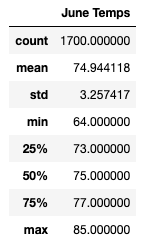
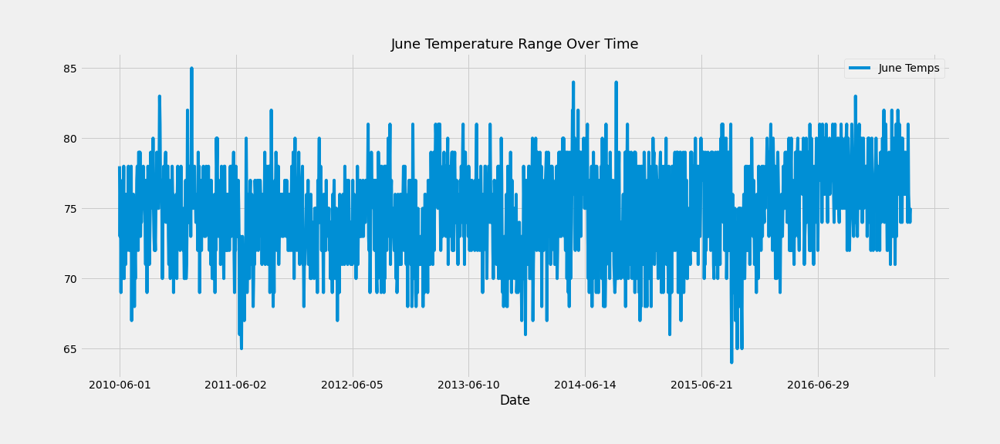
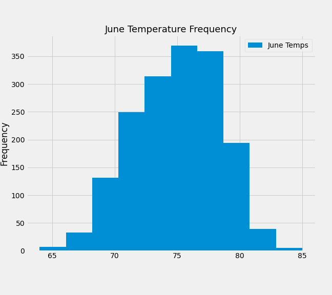
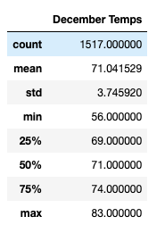
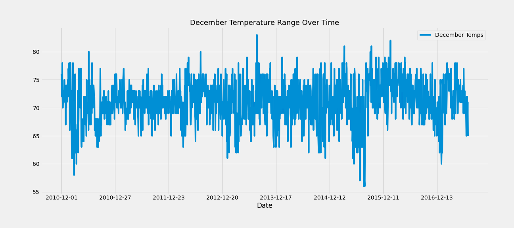
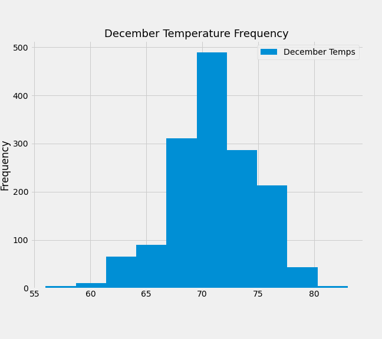

# surfs_up
## Overview
The goal of this analysis is to see if it is sustainable to open a surf shop all year round in Oahu, Hawaii. The main analysis focus will be for the months of June and December over the course of several years. The investor who is interested in opening this surf shop main concern is the precipitation and the weather is suitable for surfing. Frequent precipitation and lower temperature may cause a distruptive flow to customer traffic patterns. 

The inital weather data was given in a sqlite file. Therefore, SQLAlchemy and a SQLite database was setup to complete analysis. The analysis produce 3 main files:

- [Climate Analysis](climate_analysis.ipynb)
  - This file contains inital exploratory analysis on the weather data to get a familiarity with the data set. 
- [SurfsUp Challenge](SurfsUp_Challenge.ipynb)
  - This file contains the acutal analyis for June and December 
- [Flask App](app.py) 
  - This file setup an Flask app for users to run quick queries without writing a complex query. 

Note: the data date range for this anaylsis is from 2010 to 2017
## Results 

### June Summary Statistics and Charts 

### December Summary Statistics and Charts 

1. It appears that the June has a higer max. temperature of 85 F compared December of 81 F. 

2. The min. temperature for June is 64 F compared to Decembers of 56 F. 

3. The average temperature of June is 75 F compared to December it is 71 F.   

## Summary 
It appears the weather for June and December are relatively the same. It is slightly cooler in December compared to June as you can see from the min, max, and average as well as the "Temperature Frequency" graphs shows a higher distribution of warmer in June. However the "Temperature Ranage Over Time" chart shows us that the range between the months are relatively the same. The investor should feel comforatable enough with this in mind to open a surf shop in Oahu, Hawaii.